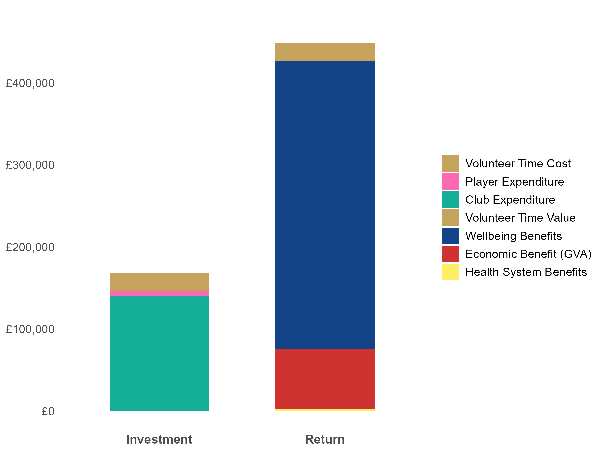

```{r setup, include=FALSE}
knitr::opts_chunk$set(echo = FALSE)
library(officer)
library(flextable)
library(dplyr)
library(ggplot2)
library(scales)

# Calculate total wellbeing value (pre-additionality)
total_wellbeing <- params$wellby_adult + params$wellby_youth + params$wellby_volunteer
# Calculate percentage breakdowns for wellbeing
wb_adult_pct <- round((params$wellby_adult / total_wellbeing) * 100, 1)
wb_youth_pct <- round((params$wellby_youth / total_wellbeing) * 100, 1)
wb_vol_pct <- round((params$wellby_volunteer / total_wellbeing) * 100, 1)
# Calculate return components
percentages <- c(
  `the wellbeing impact on our players aged over 16` = params$wellby_adult / params$return * 100,
  `the wellbeing impact on children and young people aged under 16` = params$wellby_youth / params$return * 100,
  `the wellbeing boost our volunteers get` = params$wellby_volunteer / params$return * 100,
  `the value of time put in by our volunteers` = params$replacement_value / params$return * 100,
  `the economic value we create` = params$economic_value / params$return * 100,
  `reduced pressure on health services` = params$health_value / params$return * 100
)
# Sort and identify key components
percentages <- sort(percentages[percentages > 0], decreasing = TRUE)
top_two <- head(percentages, 2)
largest <- names(top_two)[1]
second_largest <- names(top_two)[2]

# Sensitivity calculations
    wellbeing_proportion <- total_wellbeing/params$return

    # Base SROI
    base_sroi <- params$sroi
    
    # Additionality effects (affects all components)
    add_low <- base_sroi * (40/60)
    add_high <- base_sroi * (80/60)
    
    # WELLBY effects (only affects wellbeing portion)
    wellby_component <- base_sroi * wellbeing_proportion
    other_component <- base_sroi * (1 - wellbeing_proportion)
    wellby_low <- (wellby_component * 0.769) + other_component
    wellby_high <- (wellby_component * 1.231) + other_component
    
    # Combined effects
    combined_low <- (wellby_component * 0.769 * 40/60) + (other_component * 40/60)
    combined_high <- (wellby_component * 1.231 * 80/60) + (other_component * 80/60)

```

\
\

## `r format(Sys.Date(), "%d %B %Y")`

\newpage

# Summary

## Our Impact

We're not just running a football club, we're building a community: `r if(!is.null(params$club_name)) params$club_name else "Our club"` generates £`r format(round(params$sroi, 1), nsmall = 2)` in social, health and economic benefits. This creates a net return of £`r format(round(params$net_value), big.mark = ",", scientific = FALSE)`.\

Our estimated annual benefits of £`r format(round(params$return), big.mark = ",", scientific = FALSE)` include:\

- Healthier, happier players and volunteers: £`r format(round(total_wellbeing), big.mark = ",", scientific = FALSE)`
- Reduced pressure on health services: £`r format(round(params$health_value), big.mark = ",", scientific = FALSE)`
- Economic benefits: £`r format(round(params$economic_value), big.mark = ",", scientific = FALSE)`\

We estimate a total investment of £`r format(round(params$investment), big.mark = ",", scientific = FALSE)` from:\

- Club costs: £`r format(round(params$annual_expenditure), big.mark = ",", scientific = FALSE)`
- Player spending: £`r format(round(params$player_spending), big.mark = ",", scientific = FALSE)`
- Volunteer time value: £`r format(round(params$replacement_value), big.mark = ",", scientific = FALSE)`\

No social value estimates are precise. Testing our key assumptions suggests our return could range from £`r format(round(combined_low, 2), nsmall = 2)` to £`r format(round(combined_high, 2), nsmall = 2)` per £1 invested.\

## Our Methods

The Value F.C. web application, developed by State of Life for Essex F.A., creates professional-grade social impact analysis for grassroots football clubs. Key features include:\

1. **Measuring What Matters**: `r if(!is.null(params$club_name)) params$club_name else "Our club"` exists to improve the lives of those who take part. While benefits to public services and the economy matter, our focus is on valuing the direct benefits to our players and volunteers.

2. **Full Cost Accounting**: If a business pitched for investment based solely on it's revenues, and didn't mention its costs or profit margins, then investors wouldn't buy into them as a serious proposition. Social value is no different. A credible social return on investment (SROI) needs a comprehensive assessment of costs as well benefits. We include club expenses, player costs (kit, travel, socialising), and a money-equivalent value for volunteer time. This full cost accounting approach strengthens the credibility of our investment case.

3. **Conservative, transparent assumptions**: There are several uncertainties in any social value analysis. We detail model limitations below and provide conservative to avoid over-claiming our net return. For example, all benefits are adjusted downward by 40%, acknowledging that players might find other ways to stay active without our club. This careful approach helps to meet public investment standards.\

While State of Life assure on the Value F.C. model, `r if(!is.null(params$club_name)) params$club_name else "Our club"` take responsibility for our 'inputs' to the model and the use of this report.\

## Why Our Social Value Matters

Numbers can't capture everything that makes `r if(!is.null(params$club_name)) params$club_name else "our club"` special, but they provide compelling evidence for investors. Value F.C. levels the playing field, giving grassroots clubs access to professional-grade impact assessment.\

`r if(!is.null(params$club_name)) params$club_name else "Our club"` supports Essex FA's #MovingForward strategy, helping create a united #EssexFootball environment that tackles inequalities, delivers inspirational opportunities and improves health For All. These estimates strengthen the case for investment in grassroots football across Essex.\

\newpage

**Table 1: Investment ** \

```{r investment_table, echo=FALSE}
investment_data <- data.frame(
  Investment = c("Club Expenditure", "Player Spending", "Volunteer Time Cost", "Total"),
  Value = c(
    ifelse(is.null(params$annual_expenditure), 0, round(params$annual_expenditure)),
    ifelse(is.null(params$player_spending), 0, round(params$player_spending)),
    ifelse(is.null(params$replacement_value), 0, round(params$replacement_value)),
    ifelse(is.null(params$investment), 0, round(params$investment))
  ),
  stringsAsFactors = FALSE
)

investment_table <- flextable(investment_data) %>%
  set_header_labels(
    Investment = "Investment",
    Value = "Value (£)"
  ) %>%
  colformat_double(j = "Value", big.mark = ",", digits = 0) %>%
  theme_box() %>%
  bold(i = 4, j = 1:2) %>%
  autofit() %>%
  font(font = "FS Jack") %>%
  color(color = "#124487") %>%
  bg(part = "header", bg = "#124487") %>%
  color(part = "header", color = "white") %>%
  border(border = fp_border(color = "#C6A35C"))

investment_table
```
\

**Table 2: Benefits ** \

```{r return_table, echo=FALSE, out.width="100%"}
return_data <- data.frame(
  Return = c("Over 16s Wellbeing", "Under 16s Wellbeing", "Volunteer Wellbeing", 
             "Volunteer Time Value", "Economic Benefit (GVA)", "Health System Benefits", "Total"),
  Input = c(params$adult_players, params$youth_players, params$volunteers, 
            params$volunteers, NA, params$adult_players, NA),
  UnitValue = c(round(params$wellby_adult / params$adult_players), 
                round(params$wellby_youth / params$youth_players), 
                round(params$wellby_volunteer / params$volunteers), 
                round(params$replacement_value / params$volunteers),
                NA,
                round(params$health_value / params$adult_players),
                NA),
  Value = c(round(params$wellby_adult), round(params$wellby_youth), round(params$wellby_volunteer), 
            round(params$replacement_value), round(params$economic_value), round(params$health_value), round(params$return)))

return_table <- flextable(return_data) %>%
  set_header_labels(
    Return = "Return",
    Input = "Number of People",
    UnitValue = "Annual Value per Person (£)",
    Value = "Total Value (£)"
  ) %>%
  colformat_double(j = c("UnitValue", "Value"), big.mark = ",", digits = 0) %>%
  theme_box() %>%
  bold(i = 7, j = 1:4) %>%
  autofit() %>%
  font(font = "FS Jack") %>%
  color(color = "#124487") %>%
  bg(part = "header", bg = "#124487") %>%
  color(part = "header", color = "white") %>%
  border(border = fp_border(color = "#C6A35C"))

return_table
```

\newpage

**Figure 1: Return and Investment Breakdown**\

```{r stacked, echo=FALSE, out.width="100%"}

```

\newpage

# The Value F.C. Model

This report was generated using Value F.C., a web application developed by [State of Life](https://www.stateoflife.org/) for [Essex F.A](https://www.essexfa.com/). Supporting Essex FA's #MovingForward strategy, the tool makes professional-grade social value assessments accessible to all grassroots clubs across the county, which were previously out of reach for all but the largest and most financially well-off.\

As a club, we provide three key inputs to the app, based on participation over the last 12 months:\

- **`r params$volunteers`** volunteers
- **`r params$adult_players`** players aged over 16
- **`r params$youth_players`** players under 16\

Following Sport England's Active Lives survey definition, we only count regular players - those attending at least two sessions monthly. Regular volunteers are those who volunteer at least once a month.\

While `r if(!is.null(params$club_name)) params$club_name else "we"` are responsible for the accuracy of our inputs and therefore the resulting estimates, State of Life provides full assurance on the model's methodology, following H.M. Treasury guidelines.\

Our analysis examines four key benefits, each detailed below:\

1. **Social Investment** (£`r format(round(params$investment), big.mark = ",", scientific = FALSE)`): The annual costs of our club, including not only our own expenditure, but also player expenses, and an estimated value of unpaid volunteer time.\

2. **Wellbeing Benefits** (£`r format(round(params$wellby_adult + params$wellby_youth + params$wellby_volunteer), big.mark = ",", scientific = FALSE)`): Improvements in health and happiness for our players and volunteers, expressed in monetary-equivalent values.\

3. **Health System Benefits** (£`r format(round(params$health_value), big.mark = ",", scientific = FALSE)`): The reduced cost pressure on the NHS and other health services from a more active community.\

4. **Economic Value** (£`r format(round(params$economic_value), big.mark = ",", scientific = FALSE)`): The economic benefits generated for local businesses and suppliers across the UK.\

# Social Investment 

Full cost accounting is essential for credible investment cases. Our total annual investment of £`r format(round(params$investment), big.mark = ",", scientific = FALSE)` captures all resources needed to deliver grassroots football: direct club expenditure (`r round((params$annual_expenditure/params$investment)*100)`%), player costs beyond club fees (`r round((params$player_spending/params$investment)*100)`%), and the value of volunteer time (`r round((params$replacement_value/params$investment)*100)`%).\

## Financial cost

`r if(!is.null(params$club_name)) params$club_name else "Our club"` directly invests **£`r format(round(params$annual_expenditure), big.mark = ",", scientific = FALSE)`** in running costs and capital improvements. Beyond this, players make personal investments. Using the FA's 2019 analysis (uprated to 2023 prices), we estimate £387 total spend per player annually. However, to avoid double-counting money spent through the club, we exclude membership and match fees, and count only 50% of travel, kit, and social costs. This gives £122 per player in additional spending:\

**Table 3: Player Spending Analysis**\
```{r player_spending_table, echo=FALSE}
spending_data <- data.frame(
  Category = c("Membership fees", "Match and training fees", "Travel costs", "Kit and equipment", "Social activities", "Total"),
  FA_2019 = c("£56", "£64", "£47", "£55", "£104", "£326"),
  Uprated_2023 = c("£66", "£76", "£56", "£65", "£124", "£387"),
  Non_Club = c("£0", "£0", "£28", "£33", "£62", "£122")
)

flextable(spending_data) %>%
  set_header_labels(
    Category = "Category",
    FA_2019 = "FA (2019)",
    Uprated_2023 = "Uprated to 2023 Prices",
    Non_Club = "Non-Club Allocation"
  ) %>%
  bold(i = 6, j = 1:4) %>%
  theme_box() %>%
  autofit() %>%
  font(font = "FS Jack") %>%
  color(color = "#124487") %>%
  bg(part = "header", bg = "#124487") %>%
  color(part = "header", color = "white") %>%
  border(border = fp_border(color = "#C6A35C"))
```
\

We apply this figure to both adult and youth players, recognising that parents and carers invest in young players' participation. Across our `r params$adult_players + params$youth_players` senior and youth players, this represents **£`r format(round(params$player_spending), big.mark = ",", scientific = FALSE)`** in additional annual investment.\

## Volunteer Time Investment

Grassroots football relies on dedicated volunteers, and while their time is freely given, it represents a real social investment. Our `r params$volunteers` volunteers could be using this time for work or leisure activities - what economists call "opportunity cost". By valuing this time, we capture a crucial investment by our community in grassroots football.\

Drawing on State of Life's analysis of Sport England's Active Lives Survey, we estimate:\

- 12 hours contributed monthly per volunteer
- 9 months active volunteering per year (allowing for season breaks)
- £10.42 per hour (2023 National Living Wage)\

Note: Though the Living Wage rose to £11.44 in April 2024, we use the 2023 rate for consistency with other values in this report.\

This suggests each volunteer's time could be worth just over £1,125 annually, totaling **£`r format(round(params$replacement_value), big.mark = ",", scientific = FALSE)`** across our regular volunteers.\

We count this value twice in our analysis - as a **cost to volunteers** who give up their time, and as a **benefit to the club** that would otherwise need to pay for the services they provide. While these values cancel out in our final calculations, recognising both elements acknowledges the two-way nature of the volunteer relationship.\

The real value of volunteering extends far beyond these financial calculations - through improved wellbeing, which we explore next.\

# Social Benefits

## Being Realistic About Our Impact

When calculating the benefits our club creates, we ask a crucial question: what would happen if `r if(!is.null(params$club_name)) params$club_name else "our club"` didn't exist? It's realistic to think that some players might join other local clubs, and others might take up different sports. Being transparent about this makes our analysis more credible. Research from the Homes and Communities Agency helps us understand what typically happens with sports facilities, and how we might move from 'gross to net' impacts - known by economists as 'additionality':\

**Table 4: Sports Facility Additionality Rates**\
```{r additionality_table, echo=FALSE}
add_data <- data.frame(
  Category = c("People with access to new sport facilities",
               "New sports facilities",
               "Improved sports facilities"),
  Estimate = c("66%", "64%", "61%")
)

flextable(add_data) %>%
  set_header_labels(
    Category = "Category",
    Estimate = "Estimate"
  ) %>%
  theme_box() %>%
  autofit() %>%
  font(font = "FS Jack") %>%
  color(color = "#124487") %>%
  bg(part = "header", bg = "#124487") %>%
  color(part = "header", color = "white") %>%
  border(border = fp_border(color = "#C6A35C"))
```
\

Based on this evidence, we estimate that 60% of our impact is additional - meaning benefits that wouldn't happen without our club. The following sections detail our impacts on personal wellbeing, public health, and the economy. Each calculation includes this 60% adjustment. While this might seem cautious compared to other social value approaches, which claim all benefits, this more conservative estimate strengthens our investment case. Investors value honesty over inflated numbers, and accounting for 'additionality' is considered mandatory in Business Cases seeking public investment.\

## Our Wellbeing Impact

How do we put a value on the health and happiness benefits of grassroots football? The Treasury recommends using a simple but powerful question: "Overall, how satisfied are you with your life nowadays?" People respond on a scale from 0 (not at all satisfied) to 10 (completely satisfied). If our club helps someone move up one point on this scale for a year, that's called one Wellbeing Year, or WELLBY.[^2]\

The Treasury values one WELLBY at The Treasury values one WELLBY at £`r formatC(params$wellby_val, format = "f", big.mark = ",", digits = 0)` in 2023 prices.[^3] This allows us to compare wellbeing improvements with other costs and benefits in monetary terms.\

Using Sport England's Active Lives Survey data, we estimate the following annual values per person:\

**Adult Players** (0.093 WELLBYs each):\

- Worth £1,419 per player
- Total for `r params$adult_players` players: £`r format(round(params$wellby_adult), big.mark = ",", scientific = FALSE)`\

**Youth Players** (0.371 WELLBYs each):\

- Worth £5,661 per player
- Total for `r params$youth_players` players: £`r format(round(params$wellby_youth), big.mark = ",", scientific = FALSE)`\

**Volunteers** (0.066 WELLBYs each):\

- Worth £1,007 per volunteer
- Total for `r params$volunteers` volunteers: £`r format(round(params$wellby_volunteer), big.mark = ",", scientific = FALSE)`\

These estimates come from careful analysis controlling for age, gender, and general health. They apply to regular participants (twice monthly, 10+ minute sessions). We take these national average values as a starting point, recognising that we do not have information directly from our own players and volunteers.\

Our total wellbeing value of £`r format(round(total_wellbeing), big.mark = ",", scientific = FALSE)` is adjusted to £`r format(round(total_wellbeing * 0.6), big.mark = ",", scientific = FALSE)`, reflecting our 60% additionality assumption above:\

- Adult players: £`r format(round(params$wellby_adult * 0.6), big.mark = ",", scientific = FALSE)`
- Youth players: £`r format(round(params$wellby_youth * 0.6), big.mark = ",", scientific = FALSE)`
- Volunteers: £`r format(round(params$wellby_volunteer * 0.6), big.mark = ",", scientific = FALSE)`\

[^2]: Source: HM Treasury Green Book 2022 - https://www.gov.uk/government/publications/the-green-book-appraisal-and-evaluation-in-central-government/the-green-book-2020

[^3]: HM Treasury Wellbeing Guidance - https://www.gov.uk/government/publications/green-book-supplementary-guidance-wellbeing

# Health System Benefits 

Active people not only feel healthier, they reduce cost pressures on health services. Sport England's 2024 model shows that for every £2,500 in wellbeing benefits, an active adult generates £315 in reduced healthcare costs. This suggests health system savings worth `r round(params$health_ratio * 100, 0)`% on top of wellbeing gains. We apply the standard ratio to our adult players' wellbeing value of £`r format(round(params$wellby_adult), big.mark = ",", scientific = FALSE)`, estimating health system benefits of **£`r format(round(params$health_value), big.mark = ",", scientific = FALSE)`**.\

The Sport England model covers 17 health outcomes:\

- Reduced risk of major conditions including heart disease, stroke, type 2 diabetes, seven types of cancer, dementia, depression, hip fractures, and back pain
- Lower demand for GP visits and mental health services
- Balanced against an increased risk of sports injuries\

While these estimates are based on average benefits of physical activity, we recognise that football's specific health outcomes may differ. For instance, footballers might see greater cardiovascular benefits but also face different injury risks compared to other sports. Following Sport England's approach, we exclude youth participants from health system calculations. While younger players undoubtedly benefit from football, the Sport England analysis considers a lack of robust evidence linking their physical activity to specific health risks and costs.\

# Economic Value

Our total spending of £`r format(round(params$annual_expenditure + params$player_spending), big.mark = ",", scientific = FALSE)` (£`r format(round(params$annual_expenditure), big.mark = ",", scientific = FALSE)` club expenditure plus £`r format(round(params$player_spending), big.mark = ",", scientific = FALSE)` player spending) generates wider economic benefits through a chain of impacts on local business and suppliers throughout the UK. The DCMS Sport Satellite Account 2024 helps us track this chain.\

Across sport, about 54p in every £1 spent represents Gross Value Added (GVA). Take a football club bar as an example: if it sells £1,000 of beer but pays £460 to the brewery, this would create £540 in direct economic value.\

This initial value grows through "multiplier effects" - e.g., when businesses buy from their suppliers, and when their staff spend their wages. The Sport Satellite Account estimates these indirect effects, which boost the initial value by 55%.\

We again adjust downwards for our 60% 'additionality' assumption because, if the club didn't exist, players would still spend money to socialise, buy sports kit etc. Based on these assumptions, we estimate `r if(!is.null(params$club_name)) params$club_name else "our club"` generates **£`r format(round(params$economic_value), big.mark = ",", scientific = FALSE)`** in economic value for the UK.\

While significant, this economic return only offsets about half our total spending. This reinforces two key points:
1. We must count spending as a cost before considering its economic benefits
2. Economic returns alone don't justify grassroots football - our social and health impacts complete the investment case\

A note on our approach: By using the Sport Satellite Account we assume football spending creates similar economic value to other sports. While we measure impacts across the UK economy rather than just locally, much of this value likely stays in our community through local jobs and business profits. Following Treasury guidelines, we exclude impacts from imported goods (like overseas-manufactured kit) to focus solely on value created within the UK economy.\

# Uncertainty

Valuation is an inexact science so we can never be certain of the precise social return for any investment. While we're confident in our approach to measuring social value, we recognise that some of our assumptions could reasonably be different. Two key assumptions are especially important to our estimated return of £`r format(round(params$sroi, 2), nsmall = 2)` per £1 invested:\

1. We assumed 60% of the total benefits are genuinely attributable to the club ('additional') whereas some benefits would have occurred anyway. We test the return based on range from 40% to 80%.\

2. The Treasury values one WELLBY at £`r formatC(params$wellby_val, format = "f", big.mark = ",", digits = 0)` in 2023 prices, but they recommend testing a range from £`r formatC(params$wellby_val * 0.769, format = "f", big.mark = ",", digits = 0)` to £`r formatC(params$wellby_val * 1.231, format = "f", big.mark = ",", digits = 0)`.\

The 'combined effect' below shows what happens when both of these assumptions vary together - if both take the more cautious lower assumption, or both are optimistic.\

**Table 5: How Different Assumptions Affect Our Social Return**\

```{r sensitivity_calcs, echo=FALSE}
# Calculate wellbeing proportion of total benefits
wellbeing_total <- params$wellby_adult + params$wellby_youth + params$wellby_volunteer
total_benefits <- params$return
wellbeing_proportion <- wellbeing_total/total_benefits

# Base SROI
base_sroi <- params$sroi

# Additionality effects (affects all components)
add_low <- base_sroi * (40/60)
add_high <- base_sroi * (80/60)

# WELLBY effects (only affects wellbeing portion)
wellby_component <- base_sroi * wellbeing_proportion
other_component <- base_sroi * (1 - wellbeing_proportion)
wellby_low <- (wellby_component * 0.769) + other_component
wellby_high <- (wellby_component * 1.231) + other_component

# Combined effects
combined_low <- (wellby_component * 0.769 * 40/60) + (other_component * 40/60)
combined_high <- (wellby_component * 1.231 * 80/60) + (other_component * 80/60)

sensitivity_data <- data.frame(
  Assumption = c("Central estimate", 
                "Additionality (40-80%)", 
                "WELLBY value (±23%)",
                "Combined effect"),
  Low = c(base_sroi, add_low, wellby_low, combined_low),
  High = c(base_sroi, add_high, wellby_high, combined_high)
)

# Create table
flextable(sensitivity_data) %>%
  set_header_labels(
    Assumption = "Assumption",
    Low = "Lower bound",
    High = "Upper bound"
  ) %>%
  colformat_double(j = c("Low", "High"), big.mark = ",", digits = 2) %>%
  theme_box() %>%
  autofit() %>%
  font(font = "Arial") %>%
  color(color = "#124487") %>%
  bg(part = "header", bg = "#124487") %>%
  color(part = "header", color = "white") %>%
  border(border = fp_border(color = "#C6A35C"))
```

\

```{r tornado_chart, echo=FALSE, fig.height=3, warning=FALSE}
# Register Arial font for Windows
if (.Platform$OS.type == "windows") {
  windowsFonts(Arial = windowsFont("Arial"))
}

# Create tornado chart data
base <- base_sroi
variables <- c("Combined effect", "WELLBY value", "Additionality")
low_effects <- c(combined_low - base, wellby_low - base, add_low - base)
high_effects <- c(combined_high - base, wellby_high - base, add_high - base)

# Create tornado plot data
tornado_data <- data.frame(
  Variable = factor(variables, levels = variables),
  Low = low_effects,
  High = high_effects
)

# Create the plot with Essex FA colors
ggplot(tornado_data) +
  geom_vline(xintercept = 0, color = "#C6A35C", linetype = "dashed") +
  geom_bar(aes(x = Variable, y = High), stat = "identity", fill = "#124487", alpha = 0.7) +
  geom_bar(aes(x = Variable, y = Low), stat = "identity", fill = "#CE3231", alpha = 0.7) +
  coord_flip() +
  scale_y_continuous(
    labels = function(x) sprintf("%.2f", x),
    limits = function(x) c(min(low_effects) * 1.1, max(high_effects) * 1.1)
  ) +
  theme_minimal() +
  labs(
    title = "Figure 2: Impact of Different Assumptions",
    x = "",
    y = "Change in Social Return (£ per £1)"
  ) +
  theme(
    text = element_text(family = "Arial"),
    plot.title = element_text(size = 12, face = "bold", color = "#124487", family = "Arial"),
    axis.text = element_text(size = 10, color = "#124487", family = "Arial"),
    axis.title = element_text(color = "#124487", family = "Arial"),
    panel.grid.major.y = element_blank(),
    panel.grid.minor = element_blank()
  )
```
\

Under our most cautious assumptions (40% additionality and lower WELLBY values), we estimate a social return of £`r format(round(combined_low, 2), nsmall = 2)` per £1 invested. Under our most optimistic assumptions this rises to £`r format(round(combined_high, 2), nsmall = 2)`. This reinforces our main finding that grassroots football creates substantial social value, while recognising that no social return can ever be that precise.\

# Conclusion

This report demonstrates how `r if(!is.null(params$club_name)) params$club_name else "our club"` contributes to Essex FA's vision of "Creating a united #EssexFootball environment that tackles inequalities, delivers inspirational football opportunities and improves health For All." As part of a network of clubs across the county, we show the unique power of grassroots football to transform communities.\

Our numbers tell a compelling story: **for every £1 invested, we generate £`r format(round(params$sroi, 2), nsmall = 2)` in social return**, with sensitivity analysis suggesting this could range from £`r format(round(combined_low, 2), nsmall = 2)` to £`r format(round(combined_high, 2), nsmall = 2)`. This represents an impressive annual return of £`r format(round(params$return), big.mark = ",", scientific = FALSE)` against an investment of £`r format(round(params$investment), big.mark = ",", scientific = FALSE)`, creating net social value of £`r format(round(params$net_value), big.mark = ",", scientific = FALSE)`.\

These figures matter because they show how grassroots clubs like ours help deliver Essex FA's #MovingForward strategic priorities through to 2028. But the real champions of this story are our players and volunteers - thank you for making `r if(!is.null(params$club_name)) params$club_name else "our club"` a vital part of a healthier, happier community.\
